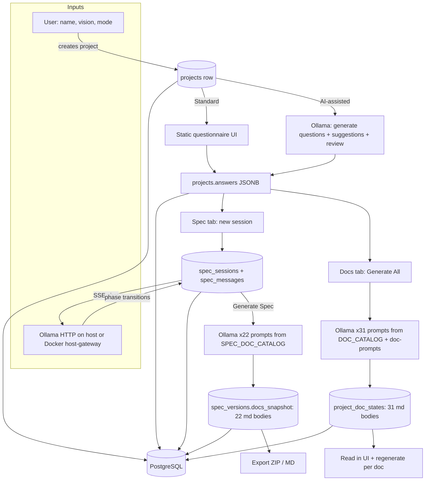
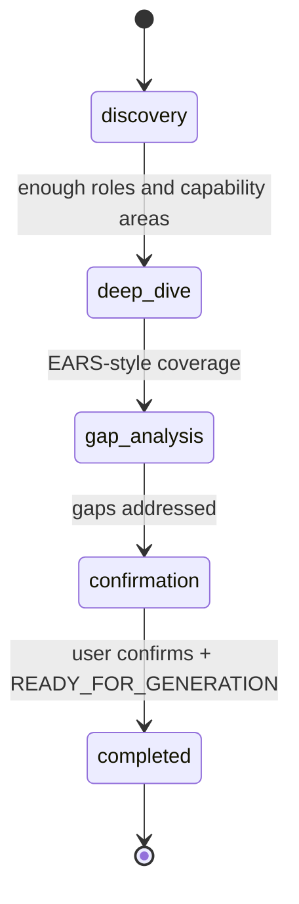

# Specter — system flow for AI coding agents

Use this document when you need a **precise mental model** of what Specter does: inputs, where Ollama is called, what is persisted, and what the **markdown-shaped outputs** are. All generation is **local** (Ollama + optional PostgreSQL); nothing is sent to a cloud LLM by default.

---

## 1. Point-by-point contract

1. **User creates a project** with `name`, `vision`, and a **mode**: *Standard* (fixed questionnaire) or *AI-assisted* (dynamic questions).
2. **Project intake** always ends in structured data in PostgreSQL table `projects`, mainly column **`answers`** (JSONB). AI-assisted mode may also use **`custom_questions`** (JSONB).
3. **Ollama (HTTP)** is the only LLM. Settings (`app_settings`) store `ollama_base_url` and `ollama_model`; prompts are built server-side (Express).
4. **Spec Agent** (per project, many sessions): user chats in phases **`discovery` → `deep_dive` → `gap_analysis` → `confirmation` → `completed`**. Messages live in **`spec_messages`**; session state in **`spec_sessions`** (including `elicited_summary_jsonb` for structured requirements extracted during the chat).
5. **Generate Spec** (after requirements are ready): the server runs **22 parallel-ish Ollama calls** (concurrency limit 2) using `SPEC_DOC_CATALOG` in `app/server/lib/specDocCatalog.js`. Each call returns **markdown body** for one file key (e.g. `01-project-brief.md`).
6. **Spec package storage**: all 22 bodies are stored together in **`spec_versions.docs_snapshot`** (JSONB: keyed by filename, value includes `content`, `status`, `wordCount`, etc.). This is the canonical “22 md files” bundle inside the DB.
7. **Docs catalog** (31 documents): separate from the spec package. Prompts come from `app/server/lib/doc-prompts.js` and catalog keys from **`DOC_CATALOG`** in `app/server/db/pool.js`. Each doc is a row in **`project_doc_states`** with **`content`** (markdown text). Generation can stream progress via SSE.
8. **Project Chat** tab: conversational Q&A over the project context; does not by itself write the 22- or 31-doc bundles (it uses conversation storage elsewhere — treat as advisory channel).
9. **Exports**: Spec versions can be exported as **ZIP** or single **Markdown** from the API/UI; legacy **`CONTRACT_OUTPUT_DIR`** may still relate to older file export paths — primary UX is DB-backed markdown.
10. **Frontend** reads/writes via REST + SSE (`VITE_API_BASE_URL` → Express on `API_PORT`).

---

## 2. End-to-end flow (Mermaid)

---

## 3. Spec Agent phases (Mermaid)

Phases are enforced in prompts (`app/server/lib/specPromptBuilder.js`) and updated from assistant signals (`app/server/routes/specChat.js`).

---

## 4. Two markdown output channels (compare)

| Channel | Count | Storage table | Catalog definition | Typical consumer |
|--------|------:|----------------|----------------------|------------------|
| **Spec package** | 22 | `spec_versions` → `docs_snapshot` | `specDocCatalog.js` | Versioned release of requirements/spec for build |
| **Docs catalog** | 31 | `project_doc_states` | `pool.js` `DOC_CATALOG` + `doc-prompts.js` | Architecture / delivery / security narrative from intake |

Both are **markdown content** generated by Ollama from **project answers + (for specs) session requirements context**.

---

## 5. Raw diagram file

The same flowchart is duplicated as machine-friendly Mermaid-only source: [`specter-system-flow.mmd`](./specter-system-flow.mmd).
